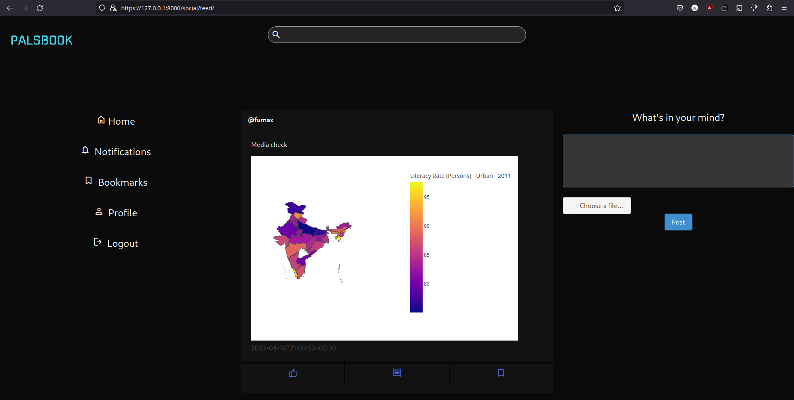
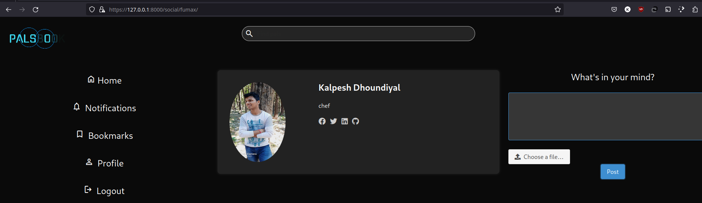

# Palsbook

A basic Social Media website where users can create posts and interact with pals.


### Features

* User authentication and JWT Tokenisation.
* Pagination ensures smooth running of app.
* SSL protocol.
* Comment section to interact with a post.
* Bookmarks to save the posts you like.
* Search to find matching tweets and people.
* Basic profile customisation.

## Requirements

* [Python](https://www.python.org/downloads/) 3.8 or above
* [pip](https://pip.pypa.io/en/stable/installing/) 20.1 or above
* [Django](https://pypi.org/project/Django/)
* [Django-Rest-Framework](https://pypi.org/project/djangorestframework/k)
* [DJ-Rest-Auth](https://pypi.org/project/dj-rest-auth/)
* [Bulma(for Django)](https://pypi.org/project/django-bulma/)
* [SimpleJWT](https://pypi.org/project/djangorestframework-simplejwt/)
* [MariaDB](https://mariadb.org/https://mariadb.org/)

## Running

After succefully installing the above dependencies, proceed to the below instructions.

Firstly, navigate to `socialMedia > settings.py`and edit the `NAME`, `USER` and `PASSWORD` in `DATABASES` section to match with your data.

Next step is to perform migrations, i.e. giving structure to the Database to incorprate all the fields required to store data.
Navigate to the main folder, and run the following instruction in console/terminal.
To dig and update last N no of tweets,

```shell
python manage.py make migrations
python manage.py migrate
```

Finally, its time to run the Server.
To dig and update last N no of tweets,

```shell
python manage.py runsslserver
```

SImply open your Web Browser and navigate to `https://127.0.0.1:8000/https://127.0.0.1:8000/`.

#### Note

The app is under development. Some features or buttons may not work in the current state.


#### Screenshots







